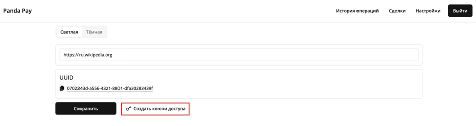

# Руководство по генерации ключей

## Настройка и аутентификация

Перед началом работы с API необходимо создать и настроить ключи доступа в личном кабинете.

### 1. Создание ключей API

1. Перейдите в **настройки личного кабинета**.
2. Нажмите кнопку **«Создать новые ключи»**.

<figure><figcaption></figcaption></figure>

> &#x20;  **ВАЖНО: Безопасность ключей**
>
> * **Скопируйте и сохраните** оба ключа сразу после создания. **Secret API Key** отображается только один раз.
> * **Никогда не передавайте** свой `Secret API Key` третьим лицам и не публикуйте в публичных репозиториях.
> * **Храните** `Secret API Key` в безопасном месте (например, в зашифрованном хранилище или менеджере секретов вашего сервера).
> * Одновременно может быть активна **только одна пара ключей**. Создание новых ключей сделает предыдущие недействительными.

<figure><figcaption></figcaption></figure>

### 2. Авторизация запросов

Все запросы к защищенным эндпоинтам API должны содержать аутентификационные данные.

#### Учетные данные

Для формирования подписанного запроса вам понадобятся:

| Параметр | Описание                                                     |
| -------- | ------------------------------------------------------------ |
| `apiKey` | Ваш публичный **API Key**, выданный в личном кабинете.       |
| `secret` | Ваш закрытый **Secret API Key**, выданный в личном кабинете. |

#### Обязательные заголовки

Каждый запрос должен включать следующие HTTP-заголовки:

| Заголовок          | Значение                | Описание                                                                                                                 |
| ------------------ | ----------------------- | ------------------------------------------------------------------------------------------------------------------------ |
| **`X-API-Key`**    | `<Ваш_API_Key>`         | Публичный ключ для идентификации мерчанта.                                                                               |
| **`X-Timestamp`**  | `<Unix_timestamp>`      | Текущее время в формате [Unix timestamp](https://www.unixtimestamp.com/) (количество секунд с 1 января 1970 года) в UTC. |
| **`X-Signature`**  | `<HMAC_SHA256_подпись>` | Цифровая подпись запроса, сгенерированная с использованием `secret`. Алгоритм генерации приведен ниже.                   |
| **`Content-Type`** | `application/json`      | Указывает, что тело запроса (если есть) передается в формате JSON.                                                       |

***

###
